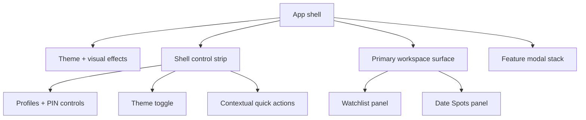

# Site Layout

## High-Level Structure

The site is a single-page React app with two primary workspaces:

- `Watchlist` mode (`queue`)
- `Date Spots` mode (`places`)

The shell is intentionally simpler than earlier revisions. It now focuses on:

1. shared profile state
2. one retained quiz ritual
3. one workspace switcher
4. the active primary panel

## Global App Shell

The top-level structure is:

1. `ThemeProvider` plus visual effects layer (`RetroEffects`, optional `MagicComponent` / moiré background, `VignetteOverlay` edge strips with frosted backdrop — adapted from [personal-website `theme/_vignette`](https://github.com/guitarbeat/personal-website/blob/main/src/sass/theme/_vignette.scss))
2. Accessibility skip link to `#main-content`
3. Static **shell control strip** (`.shell-control-strip`) in normal page flow above the workspace; it holds profile/session controls, the Movies/Places `ThemeToggle`, and direct quick-action buttons.
4. Main column (`.app-workspace-stack`) stacks the shell control strip above the primary workspace (`AppWorkspaceShell`); **no** outer “picture frame” wrapper.
5. Primary workspace surface
6. Shared feature modal stack

Still removed from the main shell:

- command deck support rail

## Profiles / session strip

Profiles now live inside the left side of the static shell control strip.

- `UserSelection` (`shell` variant inside the strip)
- Guest vs named profile, PIN entry, PIN settings, logout
- Profiles remain always visible on both desktop and mobile

## Quick Actions

Quick actions now live in the right side of the shell control strip as direct buttons.

- `Messages` is opened via a single floating action button anchored bottom-right (no radial menu)
- quiz launch state (`Edit Quiz`, `Start Quiz`, `Retake Quiz`) is visible in both workspaces
- `Notes` and `Spin & Match` only appear in `Watchlist`
- Background toggle (Moire ↔ Water) lives next to the `ThemeToggle` in the app header

## Workspace Header

Workspace switching uses the persistent `ThemeToggle` in the app header alongside the background toggle. There is one Messages FAB and no radial menu.

## Main Workspace Layout

### Desktop

- static shell control strip above the workspace
- one primary workspace surface underneath
- no persistent support rail

### Mobile

- same order as desktop, stacked into a single column
- shell control strip remains visible at the top
- no bottom navigation
- no shell-level More sheet

## Primary Panels

### 1) Watchlist Panel (`Watchlist`)

Primary control stack:

- add/recommend input
- always-visible section stack (`Suggestions`, `Queue`, `Watched`)
- small memory summary pills

Content area:

- movie cards
- suggestion cards
- loading skeleton state
- empty states

Memories:

- memories live only inside the watchlist flow
- movie cards can expand inline memories
- mobile movie sheet can jump into that same memory path
- no standalone shell-level memories modal

Other surfaces:

- confetti when both users mark a movie watched
- delete confirmation dialog

### 2) Date Spots Panel (`PlacesList`)

Primary control stack:

- add input
- always-visible section stack (`Queue`, `Visited`)
- queue / visited summary pills

Supporting panel:

- map preview card
- helper copy when spots exist without map coordinates

Content area:

- responsive place card grid
- visited / unvisited toggle
- delete action
- loading skeleton state
- empty states

Other surfaces:

- delete confirmation dialog

## Modal Stack

The shell-level modal stack now covers:

- `Quiz Editor`
- `Quiz Flow`
- `Spin Wheel`
- `Matchmaker`

Still pruned from the active product surface:

- standalone `Memories` modal

## Theming + Visual Behavior

- wax / parchment overrides now style the static shell control strip and the workspace surfaces directly
- theme context is driven by the active workspace
- `body[data-theme]` switches between movie and places palettes
- optional CRT and cursor-trail effects still respect saved state
- shell chrome is calmer, but the Y2K textures, gradients, and motion language remain

## Compact Diagram

