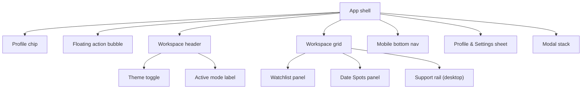

# Site Layout

## High-Level Structure

The site is a single-page React app with a shared shell and two primary workspaces:

- `Watchlist` mode (`queue`)
- `Date Spots` mode (`places`)

The shell remains consistent while the main workspace swaps between these two panels.

## Global App Shell

The top-level structure is:

1. `ThemeProvider` + visual effects layer (`RetroEffects`)
2. Fixed profile chip in the top-left (opens profile/settings sheet)
3. Draggable floating action bubble (opens quick actions)
4. Main workspace area (`#main-content`)
5. Mobile-only bottom navigation
6. Bottom sheet and modal stack for tools/minigames

There is also an accessibility skip link that jumps directly to `#main-content`.

## Main Workspace Layout

### Header Area

- Workspace mode toggle (`ThemeToggle`) switches between `Watchlist` and `Date Spots`
- Active mode indicator shows icon + label (for example, `🎬 Watchlist Mode`)

### Core Grid

Desktop:

- Two-column grid:
  - Left: primary tab panel (`Watchlist` or `Date Spots`)
  - Right: support rail with `Quick Actions` command deck

Mobile:

- Single-column content flow
- Inline hero section with profile selection bubbles
- No persistent right-side support rail

## Navigation Model

### Desktop

- `ThemeToggle` controls the active workspace tab
- Profile chip and floating action bubble are always available

### Mobile

- Bottom nav contains:
  - `Watchlist`
  - `Date Spots`
  - `More` (opens sheet with profile/settings/actions)

## Primary Panels

### 1) Watchlist Panel (`Watchlist`)

Desktop internal layout:

- Left sticky controls column:
  - Content tab switch (movies vs suggestions)
  - Sorting controls
  - Search/add input and random pick action
- Right content grid:
  - Movie cards or suggestion cards
  - Loading skeleton state
  - Empty-state messages

Mobile internal layout:

- Controls stacked above content grid

Other surfaces:

- Confetti layer when both users mark a movie watched
- Delete confirmation dialog for movie removal

### 2) Date Spots Panel (`PlacesList`)

Top section:

- Title + short explanatory copy

Two-card workspace section:

- Card 1: Add-new-spot form (name, notes, submit)
- Card 2: Map preview (`PlacesMap`) with optional helper text

List section:

- Sub-nav tabs:
  - `Dream spots`
  - `Been together`
- Responsive card grid of places
- Place actions:
  - Mark visited/unvisited
  - Delete

Other surfaces:

- Loading skeleton state
- Delete confirmation dialog (with undo flow via toast)

## Utility/Action Surfaces

### Floating Action Bubble

- Always visible, draggable, fixed-position bubble
- Opens a compact quick-actions menu near bubble position
- Menu includes:
  - Quiz (start/retake or edit)
  - Matchmaker
  - Memories
  - Spin Wheel
  - Food Merge
  - CRT toggle
  - Cursor trail toggle

### Quick Actions Rail (Desktop)

- Right-side support card with full-size `CommandDeck` buttons
- Mirrors the same action set as the bubble menu

### Bottom Sheet (Mobile + shared trigger)

`Profile & Settings` sheet contains:

- User/profile selection panel
- PIN management + logout (inside profile component)
- Compact actions deck

### Modal Stack

The app uses `MinigameModal` overlays for feature workflows:

- Quiz Editor
- Food Merge
- Spin Wheel (close can be temporarily locked while spinning)
- Memories
- Quiz Flow experience
- Matchmaker

Each modal is scrollable internally and sized per feature.

## Theming + Visual Behavior

- Theme context is driven by active workspace (`movies` vs `places`)
- Body `data-theme` attribute updates when tab changes
- Retro visual effects can be toggled:
  - CRT overlay
  - Cursor trail
- Animations are used for panel transitions, card entrances, and quick-action surfaces

## Compact Diagram

