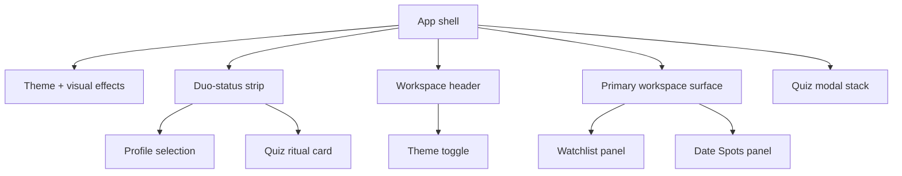

# Site Layout

## High-Level Structure

The site is a single-page React app with two primary workspaces:

- `Watchlist` mode (`queue`)
- `Date Spots` mode (`places`)

The shell is intentionally simpler than earlier revisions. It now focuses on:

1. shared profile state
2. one retained quiz ritual
3. one workspace switcher
4. the active primary panel

## Global App Shell

The top-level structure is:

1. `ThemeProvider` plus visual effects layer (`RetroEffects`, optional `Moire`, frame effect)
2. Accessibility skip link to `#main-content`
3. Persistent duo-status strip
   - profile selection and seat state
   - one quiz launch card (`Start`, `Retake`, or `Edit`)
4. Workspace header
   - active workspace label
   - shared `ThemeToggle` for switching between `Watchlist` and `Date Spots`
5. Primary workspace surface
6. Quiz-only modal stack

Removed from the main shell:

- floating action bubble
- action fan menu
- command deck support rail
- shell-level memories launcher
- spin wheel and matchmaker launch paths

## Duo-Status Area

The duo-status strip is always above the active workspace and is the only persistent secondary surface.

### Left side

- `UserSelection` panel
- active seat / guest state
- PIN and logout actions stay attached to profile management

### Right side

- `Compatibility Quiz` ritual card
- CTA changes by state:
  - `Edit Quiz` when no profile is active
  - `Start Quiz` for a fresh run
  - `Retake Quiz` after completion

## Workspace Header

The workspace header is shared by both modes and contains:

- active mode eyebrow + icon
- mode title and short explanatory copy
- `ThemeToggle`

The shell owns workspace switching; the individual workspaces no longer render their own mode toggles.

## Main Workspace Layout

### Desktop

- duo-status strip at top
- shared workspace header below it
- one primary workspace surface underneath
- no persistent support rail

### Mobile

- same order as desktop, stacked into a single column
- no bottom navigation
- no shell-level More sheet

## Primary Panels

### 1) Watchlist Panel (`Watchlist`)

Primary control stack:

- content tabs (`All`, `Queue`, `Watched`, `Suggestions`)
- sort controls
- search/add input
- random pick action
- small memory summary pills

Content area:

- movie cards
- suggestion cards
- loading skeleton state
- empty states

Memories:

- memories live only inside the watchlist flow
- movie cards can expand inline memories
- mobile movie sheet can jump into that same memory path
- no standalone shell-level memories modal

Other surfaces:

- confetti when both users mark a movie watched
- delete confirmation dialog

### 2) Date Spots Panel (`PlacesList`)

Primary control stack:

- content tabs (`All`, `Queue`, `Visited`)
- sort controls
- search/add input
- random pick action
- queue / visited summary pills

Supporting panel:

- map preview card
- helper copy when spots exist without map coordinates

Content area:

- responsive place card grid
- visited / unvisited toggle
- delete action
- loading skeleton state
- empty states

Other surfaces:

- delete confirmation dialog

## Modal Stack

The shell-level modal stack now covers quiz only:

- `Quiz Editor`
- `Quiz Flow`

Pruned from the active product surface:

- `Spin Wheel`
- `Matchmaker`
- standalone `Memories` modal

## Theming + Visual Behavior

- theme context is driven by the active workspace
- `body[data-theme]` switches between movie and places palettes
- optional CRT and cursor-trail effects still respect saved state
- shell chrome is calmer, but the Y2K textures, gradients, and motion language remain

## Compact Diagram

