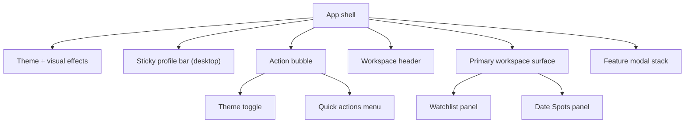

# Site Layout

## High-Level Structure

The site is a single-page React app with two primary workspaces:

- `Watchlist` mode (`queue`)
- `Date Spots` mode (`places`)

The shell is intentionally simpler than earlier revisions. It now focuses on:

1. shared profile state
2. one retained quiz ritual
3. one workspace switcher
4. the active primary panel

## Global App Shell

The top-level structure is:

1. `ThemeProvider` plus visual effects layer (`RetroEffects`, optional `MagicComponent` / moiré background, `VignetteOverlay` edge strips with frosted backdrop — adapted from [personal-website `theme/_vignette`](https://github.com/guitarbeat/personal-website/blob/main/src/sass/theme/_vignette.scss))
2. Accessibility skip link to `#main-content`
3. **Desktop:** sticky **session bar** (`.app-session-bar`) with profile bubbles / PIN / logout (`UserSelection` in the main tree — not portaled). **Mobile:** profile row lives in the mobile shell header.
4. **Floating chrome** (`.app-floating-chrome`) — fixed full-viewport overlay with `pointer-events: none` so it doesn’t sit in the workspace grid; holds the draggable `ActionBubble`, `ThemeToggle`, and popover menu (Watchlist ↔ Date Spots + quick actions for quiz, spin wheel, matchmaker).
5. Main column (`.app-workspace-stack`) holds **only** the workspace (`AppWorkspaceShell`); **no** outer “picture frame” wrapper.
6. Workspace header (desktop) — mode title + copy (toggle is on the bubble, not in the header)
7. Primary workspace surface
8. Shared feature modal stack

Still removed from the main shell:

- command deck support rail
- shell-level memories launcher

## Profiles / session strip

On **desktop**, profiles sit in a **sticky top bar** inside `.app-shell__canvas--main` so they stay visible while scrolling and aren’t trapped in a fixed off-screen portal. On **mobile**, the same `UserSelection` content appears in the mobile shell header.

- `UserSelection` (`panel` on desktop in the bar)
- Guest vs named profile, PIN entry, PIN settings, logout
- Quiz and other rituals are reached from the **action bubble** menu, not this strip

## Quick Actions

The floating quick-actions layer lives in `.app-floating-chrome` (not inside `.app-workspace-stack`) so controls stay viewport-positioned and aren’t stretched by the main column grid.

- draggable `ActionBubble`
- `ActionFanMenu` anchored to the bubble
- quick launches for:
  - quiz
  - spin wheel
  - matchmaker

## Workspace Header

The workspace header is shared by both modes and contains:

- active mode eyebrow + icon
- mode title and short explanatory copy

Workspace switching uses the **`ThemeToggle` on the floating action bubble** (not a duplicate in the header).

## Main Workspace Layout

### Desktop

- sticky profile session bar at top (scrolls with the page; stays pinned at the top of the viewport)
- floating action bubble (`ThemeToggle` + quick actions)
- shared workspace header below it
- one primary workspace surface underneath
- no persistent support rail

### Mobile

- same order as desktop, stacked into a single column
- floating action bubble remains available
- no bottom navigation
- no shell-level More sheet

## Primary Panels

### 1) Watchlist Panel (`Watchlist`)

Primary control stack:

- add/recommend input
- always-visible section stack (`Suggestions`, `Queue`, `Watched`)
- small memory summary pills

Content area:

- movie cards
- suggestion cards
- loading skeleton state
- empty states

Memories:

- memories live only inside the watchlist flow
- movie cards can expand inline memories
- mobile movie sheet can jump into that same memory path
- no standalone shell-level memories modal

Other surfaces:

- confetti when both users mark a movie watched
- delete confirmation dialog

### 2) Date Spots Panel (`PlacesList`)

Primary control stack:

- add input
- always-visible section stack (`Queue`, `Visited`)
- queue / visited summary pills

Supporting panel:

- map preview card
- helper copy when spots exist without map coordinates

Content area:

- responsive place card grid
- visited / unvisited toggle
- delete action
- loading skeleton state
- empty states

Other surfaces:

- delete confirmation dialog

## Modal Stack

The shell-level modal stack now covers:

- `Quiz Editor`
- `Quiz Flow`
- `Spin Wheel`
- `Matchmaker`

Still pruned from the active product surface:

- standalone `Memories` modal

## Theming + Visual Behavior

- wax / parchment overrides for the floating action bubble and `ThemeToggle` live under `.app-shell--viewport:has(.app-workspace-stack)` in `App.scss` so they don’t compete with the earlier global “glass” chrome (e.g. logo-lab shell without the main workspace column)
- theme context is driven by the active workspace
- `body[data-theme]` switches between movie and places palettes
- optional CRT and cursor-trail effects still respect saved state
- shell chrome is calmer, but the Y2K textures, gradients, and motion language remain

## Compact Diagram

