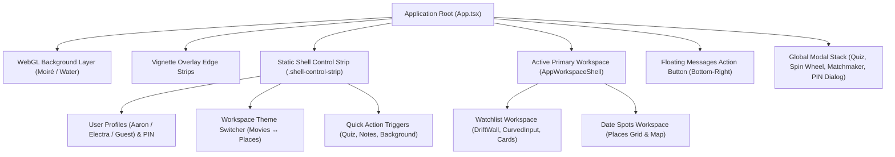

# Application Shell & Site Layout Specification

## 1. High-Level Spatial Hierarchy

**Electron** is structured around a streamlined, responsive single-page application (SPA) layout. The interface pairs a retro-future Y2K aesthetic with a clean two-workspace structure:
1. **Watchlist Workspace (`queue`)**: Shared movie watchlist, 3D kinetic DriftWall, CurvedInput discovery bar, and memories.
2. **Date Spots Workspace (`places`)**: Date-planning hub, interactive place cards, and Google Places map integration.



---

## 2. Global App Shell Structure

The root application tree is composed of the following sequential layers:

### 2.1. Background & Visual Effects Layer
- **WebGL Shader Canvas**: Renders dynamic interactive moiré or fluid water wave animations using `ogl`.
- **Vignette Overlay**: Edge gradients and frosted glass side strips that ground the view without obscuring interactive controls.
- **Retro Effects**: Optional toggleable CRT scanlines, chromatic aberration, and cursor trail particle systems.

### 2.2. Shell Control Strip (`.shell-control-strip`)
Positioned in normal document flow above the active workspace (no fixed headers obscuring content):
- **Left Zone (Identity & Security)**:
  - `UserSelection` component (switches between Aaron, Electra, and Guest).
  - PIN protection status, lockout badge, and security settings trigger.
- **Center/Right Zone (Navigation & Global Actions)**:
  - `ThemeToggle`: Instantly switches active workspace and palette (`Movies` vs `Places`).
  - `BackgroundToggle`: Toggles shader background between Moiré and Water simulations.
  - Contextual action buttons: `Start Quiz`, `Spin & Match`, and `Notes`.

---

## 3. Primary Workspaces

### 3.1. Watchlist Workspace (`Watchlist.tsx`)
The centerpiece of the movie-night experience, divided into two presentation modes:

```
 ┌─────────────────────────────────────────────────────────────┐
 │                   Watchlist Workspace                       │
 ├─────────────────────────────────────────────────────────────┤
 │ [CurvedInput SVG Search Bar] [Filter Tabs: Queue | Watched] │
 ├─────────────────────────────────────────────────────────────┤
 │                                                             │
 │   DriftWall 3D Kinetic Canvas  OR  Responsive Grid Mode     │
 │   - Multi-track infinite loop      - Outset border cards    │
 │   - 3D parallax tilt               - OMDb / TVMaze badges   │
 │   - Stereoscopic Z-lift            - Inline memory drawer   │
 │                                                             │
 └─────────────────────────────────────────────────────────────┘
```

1. **CurvedInput Search Bar (`CurvedInput.tsx`)**:
   - Math-driven SVG circular arc input for searching films and shows.
   - Dynamic autocomplete dropdown with keyboard D-pad navigation.
2. **DriftWall 3D Kinetic Canvas (`DriftWall.tsx`)**:
   - Multi-column 3D poster wall with continuous Euclidean modular looping.
   - Smooth gesture momentum, touch drags, and cursor tilt physics.
3. **Card Presentation & Memories**:
   - Outset border movie cards (`MovieCard.tsx`) displaying poster art, IMDb ratings, runtimes, and plot summaries.
   - Expandable inline memory entries where users log personal viewing memories and dates.

---

### 3.2. Date Spots Workspace (`PlacesList.tsx`)
A dedicated date-planning hub for restaurants, cocktail lounges, and activities:
1. **Places Discovery**: Google Places search input with autocomplete suggestions and photo previews.
2. **Interactive Map Card**: Displays geographic pins and routing previews for saved spots.
3. **Queue vs. Visited Tracking**: Segmented lists tracking upcoming date ideas vs. historical visits.

---

## 4. Floating Overlay & Modal Stack

### 4.1. Messages Floating Action Button (FAB)
- Anchored to the bottom-right corner (`fixed bottom-6 right-6 z-40`).
- Clicking expands an iMessage-styled chat drawer for real-time conversation between Aaron and Electra.

### 4.2. Modal Layer Hierarchy
Modals render into a high-index portal layer (`z-[10100]`) managed by `useModalBehavior`:
- **Spin Wheel Picker (`SpinWheelGame.tsx`)**: Physics-based roulette wheel that randomly selects a film from the active watchlist.
- **Matchmaker Deck (`MatchmakerGame.tsx`)**: Tinder-style swipe deck for mutual film matching.
- **Compatibility Quiz (`QuizModal.tsx`)**: Nostalgic 1990s retro internet popup-styled relationship questionnaire.
- **PIN Verification Dialog (`PinDialog.tsx`)**: Secure keypad entry modal with attempt counters and lockout timers.

---

## 5. Responsive & Multi-Device Layout Adaptation

| Device Category | Viewport Breakpoint | Layout Adaptations |
| :--- | :--- | :--- |
| **Desktop / Ultrawide** | $\ge 1200\text{px}$ | Multi-column DriftWall (5–6 columns), expansive search arc, dual-column date spot grids. |
| **Tablet / Laptop** | $768\text{px} - 1199\text{px}$ | 3–4 column DriftWall, compressed control strip, adaptive font clamps. |
| **Mobile** | $< 768\text{px}$ | Single-column stacked layout, touch gesture momentum, full-screen modal sheets, bottom-sheet memory drawers. |
| **Smart TV / 10-Foot** | All TV User Agents | ADR-001 spatial navigation: high-contrast `:focus-visible` glow rings, remote D-Pad navigation, and Back-key dismissal. |
