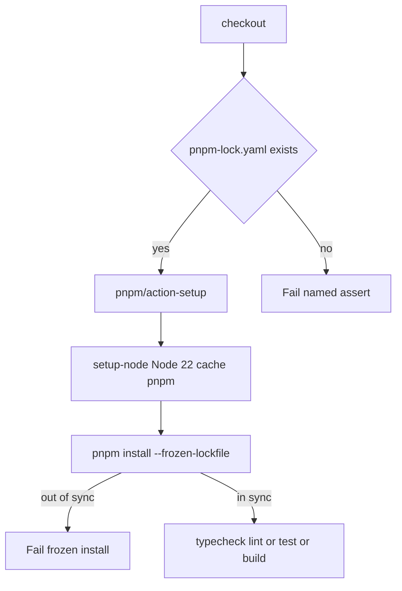

# Keep GitHub CI Green - Plan

## Goal Capsule

- **Objective:** Keep GitHub jobs Type Check & Lint, Unit Tests, and Build Bundle green when `pnpm-lock.yaml` is present and in sync. When it is absent, fail at a named lockfile assert instead of `setup-node` cache. Move first-party Actions off the Node 20 runtime before 23 September 2026, and keep those pins from rotting via grouped Actions Dependabot.
- **Authority:** Product Contract requirements, then Key Technical Decisions, then unit approach. Job display names stay `Type Check & Lint`, `Unit Tests`, and `Build Bundle`.
- **Stop when:** Those three jobs are green on a commit that includes the lockfile assert, frozen install, Node 24 majors in the scoped workflows (U1 and U2), Dependabot github-actions config (U3), and DEVELOPMENT.md `packageManager` alignment (U4). Do not migrate to `pnpm/setup`. Do not change app Node 22.
- **Execution profile:** Workflow and docs only. Proof is a green GitHub Actions CI run, not new unit tests.
- **Tail ownership:** Remove any unused composite-action or `pnpm/setup` experiment from the diff. Capture a short learning under `docs/solutions/` after ship if that directory is introduced; do not create the solutions corpus as part of this plan.

## Product Contract

### Summary

GitHub CI already passed on `9ddd8daf` after restoring `pnpm-lock.yaml`. This plan keeps those jobs green: fail early if the lockfile is gone, freeze the install, bump first-party Actions to Node 24 runtimes, and let Dependabot open grouped action PRs. Product UI and Vercel skipped checks stay out of scope.

Product Contract preservation: Product Contract unchanged (bootstrap; no upstream brainstorm).

### Problem Frame

The hard deadline is Node 20 action-runtime removal on 23 September 2026. The lockfile is already restored and CI is green; the assert and frozen install are preventive so the next accidental deletion fails with a named step instead of the cache error.

`actions/setup-node` with `cache: pnpm` hashes `pnpm-lock.yaml` at the workspace root. When that file is missing, all three CI jobs die at setup with `Dependencies lock file is not found` and never run typecheck, lint, or tests. The lockfile was deleted as collateral in large refactors more than once (`5abfe197` and earlier). The same workflows still pin `actions/checkout@v4`, `actions/setup-node@v4`, and `pnpm/action-setup@v4`, which run on Node 20. Hosted runners remove Node 20 on 23 September 2026.

### Requirements

**CI stay-green**

- R1. Type Check & Lint, Unit Tests, and Build Bundle stay the required GitHub check names and continue to run `pnpm run check-types`, `pnpm run lint`, `pnpm run test`, and `pnpm --filter '@workspace/web' run build`.
- R2. Every CI job that uses `cache: pnpm` fails before `setup-node` when `pnpm-lock.yaml` is absent, with a message that the lockfile must be committed. Empty or corrupt files still fail later at cache or frozen install (KTD2).
- R3. CI dependency install must not rewrite the lockfile and must fail when the lockfile is out of sync with manifests.

**Action runtime**

- R4. First-party JavaScript actions used in this repo must run on Node 24 action runtimes before 23 September 2026.
- R5. Project Node used by pnpm, tests, and build stays 22.

**Supply chain**

- R6. Dependabot must open grouped pull requests for GitHub Actions updates only.

### Actors

- A1. Developer or coding agent pushing or opening a PR against `main` or `master`.
- A2. GitHub-hosted `ubuntu-latest` runner.

### Key Flows

- F1. Happy path
  - **Trigger:** A1 pushes or opens a PR with `pnpm-lock.yaml` present and in sync.
  - **Actors:** A1, A2
  - **Steps:** Checkout, lockfile assert, pnpm on PATH, Node 22 with pnpm cache, frozen install, job script.
  - **Outcome:** All three named jobs green. Covers R1, R3, R5.
- F2. Missing lockfile
  - **Trigger:** Checkout has no `pnpm-lock.yaml`.
  - **Actors:** A1, A2
  - **Steps:** Assert fails with a committed-lockfile message. `setup-node` does not run.
  - **Outcome:** Job red at the assert step. Covers R2.
- F3. Action runtime after 23 September 2026
  - **Trigger:** Hosted runners no longer provide Node 20.
  - **Actors:** A2
  - **Steps:** Workflows use Node 24 action majors. App Node stays 22.
  - **Outcome:** Jobs still start. Covers R4, R5.

### Acceptance Examples

- AE1. Covers R2. Given a branch whose tree has no `pnpm-lock.yaml`, when CI runs, Then each `cache: pnpm` job fails at the lockfile assert, not at `setup-node`.
- AE2. Covers R1, R3. Given HEAD with a matching lockfile, when CI runs, Then Type Check & Lint, Unit Tests, and Build Bundle succeed as they did on run 33360349666.
- AE3. Covers R4. Given the upgraded workflow pins, when CI runs and the YAML is inspected, Then those pins are Node 24 majors, `node-version` remains `'22'`, and Type Check & Lint, Unit Tests, and Build Bundle are green on those pins.
- AE4. Covers R6. Given `.github/dependabot.yml`, when it is read, Then it enables `github-actions` only, weekly, directory `/`, with one group for Actions updates.

### Success Criteria

- The three named CI jobs are green on the implementation commit.
- A missing lockfile fails at a named assert step.
- First-party action pins in `.github/workflows/` are Node 24 majors except Vercel-owned actions.
- `.github/dependabot.yml` enables grouped `github-actions` updates only (R6).
- `docs/operations/DEVELOPMENT.md` states `pnpm@11.24.0` matching `packageManager`.

### Scope Boundaries

**In scope**

- `.github/workflows/ci.yml` bootstrap (assert, frozen install, action pins).
- Action pins in `.github/workflows/thermo-nuclear.yml` and the `actions/checkout` / `actions/setup-node` steps in `.github/workflows/deployment-checks.yml`.
- `.github/dependabot.yml` for `github-actions`.
- Align `docs/operations/DEVELOPMENT.md` pnpm version with `package.json` `packageManager`.

**Deferred to Follow-Up Work**

- GitHub rulesets, required checks, and CODEOWNERS (admin settings; review-only, does not stop deletion).
- Pre-commit / husky delete-guards (agents often skip hooks; CI is the gate).
- Migration from `pnpm/action-setup` to `pnpm/setup`.
- npm/pnpm Dependabot for application dependencies.
- Actor-gated Thermo-Nuclear review and Vercel `repository_dispatch` smoke as required merge checks.
- Speed Insights RES and product UI.

**Outside this product's identity**

- Changing application Node from 22 to 24 because GitHub action runtimes default to 24.

## Planning Contract

### Key Technical Decisions

- KTD1. Keep `pnpm-lock.yaml` committed and keep `cache: pnpm`. (session-settled: user-approved — chosen over disabling pnpm cache: cache needs the lockfile hash; disabling cache hides the missing file.)
- KTD2. Fail missing lockfile with an existence assert immediately after checkout, before `pnpm/action-setup`. Chosen over relying on `setup-node`'s cache error. Presence only; frozen install owns sync (R3).
- KTD3. Use `pnpm install --frozen-lockfile` in all three CI jobs. Chosen over bare `pnpm install`. GitHub sets `CI=true` so pnpm already freezes; the flag matches `scripts/post-merge.sh` and makes the contract visible.
- KTD4. Stay on the three-step bootstrap: `checkout` → `pnpm/action-setup` → `setup-node` with `cache: pnpm`. Chosen over `pnpm/setup@v2`, which replaces setup-node and changes cache semantics. (session-settled: user-approved — chosen over a pnpm/setup rewrite: keep-it-green plus Action upgrades, not a new installer.)
- KTD5. Pin `actions/checkout@v7`, `actions/setup-node@v7`, `pnpm/action-setup@v6`. Omit `version:` on pnpm setup so it reads `packageManager: pnpm@11.24.0`. Do not set `allow-unsafe-pr-checkout`. Do not bump `vercel/repository-dispatch/actions/checkout@v1`.
- KTD6. Add Dependabot for `github-actions` only, weekly, directory `/`, one group for all Actions updates. Chosen over ungrouped per-workflow PRs.
- KTD7. Do not rename CI job `name` fields. Required-check matching uses those strings.
- KTD8. Do not add `paths:` filters to CI. A lockfile-only deletion must still run the required jobs.

### High-Level Technical Design

CI bootstrap is a fixed protocol. The assert is a named gate in front of the cache step that previously failed first.

This sketch is directional for review. Exact YAML keys follow KTD2–KTD5.

### Assumptions

- GitHub Actions continues to set `CI=true`.
- Root `pnpm-lock.yaml` remains the only lockfile `cache: pnpm` needs. Do not add `cache-dependency-path`.
- `pnpm/action-setup@v6` still installs pnpm 11 from `packageManager` without a `version:` input.
- Thermo-Nuclear and Deployment Checks are best-effort after pin bumps. Green `ci.yml` is the ship gate.

### System-Wide Impact

CI job display names are the merge-check contract. Renaming them breaks required checks. The three CI jobs duplicate bootstrap steps; Dependabot grouped updates must bump all copies together. Thermo-nuclear and deployment-checks share checkout/setup-node pins but not pnpm cache. Vercel-owned actions stay on their own version line.

### Risks and Dependencies

- RSK1. `pnpm/action-setup@v6` is the pnpm 10-era action; maintainers point pnpm 11 at `pnpm/setup`. Mitigation: KTD4 stays on the three-step pattern. Dependabot may open a later `pnpm/setup` PR; treat that as follow-up, not this plan.
- RSK2. checkout v6+ stores credentials under `$RUNNER_TEMP`. Mitigation: this repo does not use container actions that read `.git/config` credentials.
- RSK3. Hosted runners remove Node 20 on 23 September 2026. Mitigation: U1 and U2 pin Node 24 majors now. Do not use `ACTIONS_ALLOW_USE_UNSECURE_NODE_VERSION`.
- RSK4. Frozen install fails if `packageManager` is bumped without regenerating the lockfile (pnpm 11.23+). Mitigation: regenerate `pnpm-lock.yaml` in the same commit as any `packageManager` change.
- Dependency: root `pnpm-lock.yaml` must remain committed (already true on HEAD `9ddd8daf`).

### Sequencing

U1 first (CI jobs that are required today). U2 can follow in the same change set. U3 should ship with U1 and U2 so Dependabot does not immediately reopen `@v4`. U4 may ship anytime (no runtime dependency).

### Sources and Research

- GitHub changelog: Node 20 action runtime removed 23 September 2026. https://github.blog/changelog/2025-09-19-deprecation-of-node-20-on-github-actions-runners/
- setup-node lockfile cache: https://github.com/actions/setup-node/blob/main/docs/advanced-usage.md#working-with-lockfiles
- pnpm frozen lockfile CI default: https://pnpm.io/cli/install#--frozen-lockfile
- Current majors as of 31 August 2026: `actions/checkout@v7`, `actions/setup-node@v7`, `pnpm/action-setup@v6`.
- Repo history: lockfile deleted in `5abfe197`; restored in `9ddd8daf`; CI green on run 33360349666.
- Local pattern: `scripts/post-merge.sh` already uses `--frozen-lockfile`.
- `docs/solutions/` does not exist; no institutional learnings to follow.

## Implementation Units

### U1. Harden CI bootstrap

**Goal:** Make Type Check & Lint, Unit Tests, and Build Bundle fail clearly without a lockfile, freeze installs, and run on Node 24 action majors.

**Requirements:** R1, R2, R3, R4, R5 per KTD1, KTD2, KTD3, KTD4, KTD5, KTD7, KTD8.

**Dependencies:** None.

**Files:** `.github/workflows/ci.yml`

**Approach:**

1. In each of the three jobs, after checkout and before `pnpm/action-setup`, add a step named `Assert pnpm lockfile exists` that exits 1 when `pnpm-lock.yaml` is missing, with a one-line message that the lockfile must be committed.
2. Bump to `actions/checkout@v7`, `pnpm/action-setup@v6`, `actions/setup-node@v7`. Keep `node-version: '22'` and `cache: 'pnpm'`. Leave pnpm `version:` unset.
3. Change install to `pnpm install --frozen-lockfile`.
4. Leave job `name` values and script commands unchanged. Do not add `paths:` filters. Keep the duplicated three-job bootstrap; do not introduce a composite action.

**Execution note:** Prefer a green GitHub CI run over new unit coverage. This is workflow config.

**Patterns to follow:** Existing three-job layout in `.github/workflows/ci.yml`. Frozen flag as in `scripts/post-merge.sh`.

**Test scenarios:**

- Covers AE2. Lockfile present and in sync: all three jobs pass typecheck, lint, test, and the web build.
- Covers AE1. Lockfile deleted on a throwaway branch: each job fails at the assert step, not at `setup-node`.
- Manifest changed without lockfile update: frozen install fails rather than rewriting the lockfile.
- Job names in the GitHub UI remain Type Check & Lint, Unit Tests, and Build Bundle.

**Verification:** GitHub Actions CI on the implementation commit is green. A missing-lockfile branch fails at the named assert.

### U2. Bump remaining first-party Actions

**Goal:** Remove Node 20 action runtimes from the other workflows that still pin `@v4`.

**Requirements:** R4, R5 per KTD5.

**Dependencies:** U1 (same pin set).

**Files:** `.github/workflows/thermo-nuclear.yml`, `.github/workflows/deployment-checks.yml`

**Approach:**

1. In thermo-nuclear: `actions/checkout@v7` and `actions/setup-node@v7`. Keep `node-version: '22'`. Do not add pnpm cache. Leave the actor `if:` gate unchanged.
2. In deployment-checks: bump the `workflow_dispatch` `actions/checkout@v4` to `@v7` and `actions/setup-node@v4` to `@v7` with `node-version: '22'`. Leave `vercel/repository-dispatch/actions/checkout@v1` and other Vercel actions unchanged.

**Execution note:** Green `ci.yml` is enough to ship. Thermo-nuclear is actor-gated; deployment-checks is dispatch-only.

**Patterns to follow:** Same majors as U1. Do not add lockfile assert here; these jobs do not use `cache: pnpm`.

**Test scenarios:**

- Covers AE3. thermo-nuclear.yml uses checkout@v7 and setup-node@v7 with Node 22.
- deployment-checks.yml workflow_dispatch checkout is @v7 and setup-node is @v7. The Vercel checkout action remains @v1.
- YAML still parses. Actor gate on thermo-nuclear is unchanged.

**Verification:** Workflow files pin the majors above. Optional smoke of thermo-nuclear and deployment-checks is follow-up, not a ship blocker.

### U3. Dependabot for GitHub Actions

**Goal:** Keep action majors from rotting on `@v4` again.

**Requirements:** R6 per KTD6.

**Dependencies:** U1, U2 (so the first PRs start from current majors).

**Files:** `.github/dependabot.yml`

**Approach:**

1. Create Dependabot config with `package-ecosystem: github-actions`, `directory: "/"`, weekly schedule.
2. Group all GitHub Actions updates into one PR. Cap open PRs modestly (5).
3. Do not enable npm/pnpm ecosystems in this unit.

**Patterns to follow:** Official GitHub Dependabot versioning-strategy for Actions. No existing file to copy.

**Test scenarios:**

- Config is valid YAML with a single github-actions ecosystem at `/`.
- Updates are grouped so checkout, setup-node, and pnpm/action-setup do not each open a separate PR.
- Application npm dependencies are not scanned by this config.

**Verification:** File exists with those fields. First Dependabot PR is not required before ship.

### U4. Align pnpm version in development docs

**Goal:** Stop agents from installing pnpm 9/10 from stale docs while CI uses 11.24.0.

**Requirements:** Supports R3 (lockfile major must match the installer).

**Dependencies:** None.

**Files:** `docs/operations/DEVELOPMENT.md`

**Approach:**

1. Replace the pnpm 9.x / 10.x sentence with `pnpm@11.24.0` from root `package.json` `packageManager`.
2. Keep the sentence that root `pnpm-lock.yaml` is canonical.
3. Do not invent an `engines` field in `package.json` unless already present. Docs currently cite `package.json` engines; there is no `engines` field. Drop that citation or point at `packageManager` only.

**Test expectation:** none -- documentation alignment. Proof is the version string matching `package.json`.

**Verification:** DEVELOPMENT.md states pnpm 11.24.0 and still names `pnpm-lock.yaml` as the canonical lockfile.

## Verification Contract

| Gate | Command or check | Applies |
| --- | --- | --- |
| Types | `pnpm run check-types` | U1 (unchanged scripts) |
| Lint | `pnpm run lint` | U1 |
| Unit tests | `pnpm run test` | U1 |
| Web build | `pnpm --filter '@workspace/web' run build` | U1 |
| Full local suite | `pnpm verify` | Optional local parity |
| GitHub CI | Workflow CI green on the implementation commit | U1 ship gate |
| Missing lockfile | Throwaway branch without `pnpm-lock.yaml` fails at assert | U1 AE1; do not merge that branch |
| Pin inspection | Workflow YAML uses checkout@v7, setup-node@v7, pnpm/action-setup@v6 where those actions exist | U1, U2 |
| Dependabot | `.github/dependabot.yml` present with github-actions only | U3 |
| Docs pnpm version | `docs/operations/DEVELOPMENT.md` states `pnpm@11.24.0` matching root `packageManager` and still names `pnpm-lock.yaml` as canonical | U4 |

Do not treat skipped Vercel Deployment Checks or actor-gated Thermo-Nuclear as required for this plan.

## Definition of Done

- R1–R6 are met on `main` or a PR whose CI is green.
- U1–U4 files match the approaches above. Abandoned `pnpm/setup` or composite-action experiments are not in the diff.
- Job names are unchanged.
- `node-version` remains `'22'`.
- DEVELOPMENT.md pnpm version matches `packageManager`.
- After ship, loop on the GitHub CI run until Type Check & Lint, Unit Tests, and Build Bundle are green.
